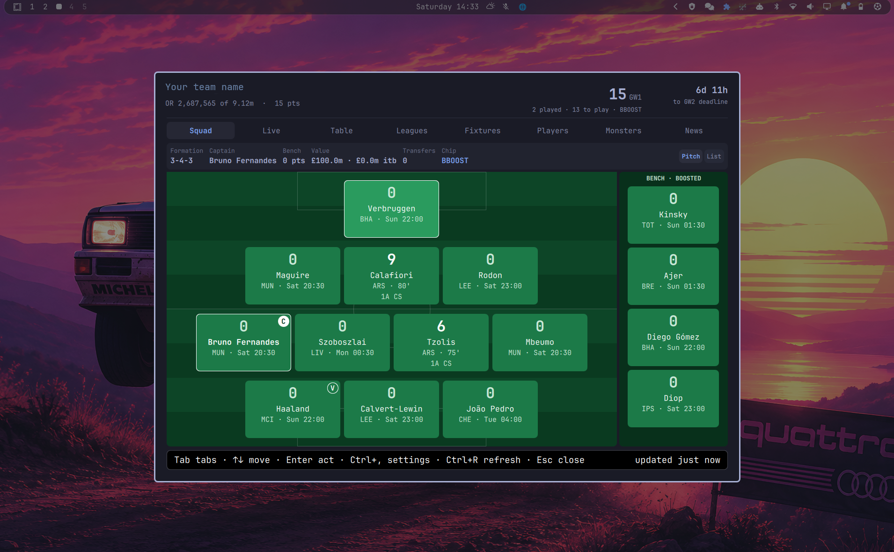
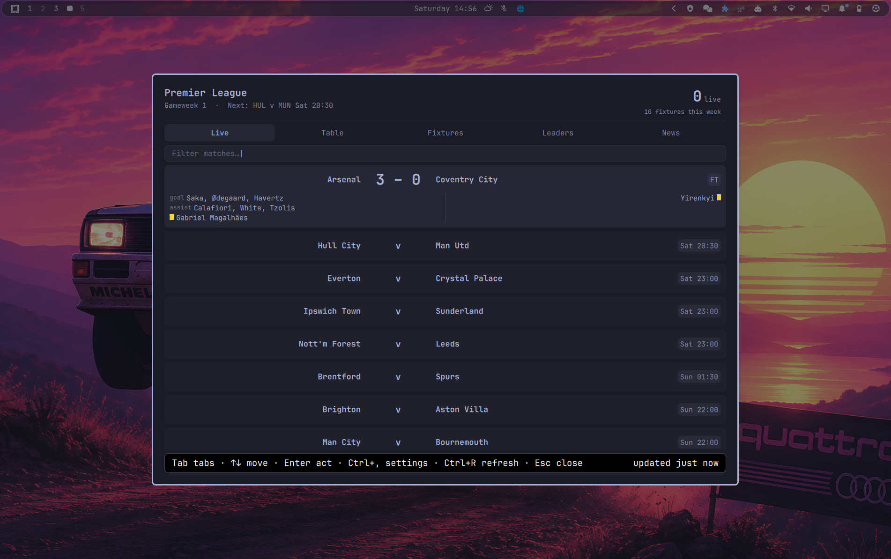

# FPL Gaffer

**The ultimate dashboard for Premier League fans — FPL mode for players and
Fan mode for everyone else.**

A Premier League and Fantasy Premier League dashboard for the
[Omarchy](https://omarchy.org) shell. Live scores, the real league table, a
fixture difficulty grid, player stats and a podium board — and, if you play
the game, your squad scored live with provisional bonus, projected auto-subs
and your mini-leagues. All of it wearing your current Omarchy theme.





Two ways to use it, chosen on first run and changeable in settings:

- **FPL Gaffer mode** — you play the game. Eight tabs: your squad as a pitch or
  a list scored live, the match ticker, the league table, your mini-leagues
  re-scored live, a fixture difficulty grid, every player in the game, the
  Monsters board, and news with price and injury watch.
- **Premier League Fan mode** — you just follow the football. Five tabs: Live,
  Table, Fixtures, Leaders and News. No fantasy team needed, and nothing that
  only means something inside the game.

| | FPL Gaffer | Premier League Fan |
| --- | --- | --- |
| Squad, Leagues, Players | ✓ | — |
| Live, Table, Fixtures, News | ✓ | ✓ |
| Podium board | Monsters — goals, defcon, value, cards, referees | Leaders — goals, tackles, blocks, recoveries, cards, referees |
| API calls per refresh | 22 | 4 |

## Install

```bash
omarchy plugin add https://github.com/weedwhitesandwine/FPL-Gaffer.git --enable
```

Then restart the shell and open it once to meet the greeter, which asks which
of the two modes you want and, in FPL Gaffer mode, for your team ID.

```bash
omarchy restart shell
```

To update or remove it later:

```bash
omarchy plugin update io.github.weedwhitesandwine.gaffer
omarchy plugin remove io.github.weedwhitesandwine.gaffer
```

Removing the plugin leaves your settings and cache in `~/.local/state/gaffer`,
so reinstalling picks up where you left off. Delete that directory yourself if
you want a clean slate.

## What it writes, and when

Everything this plugin runs and touches, in full — because a plugin shares the
shell's process and runs unsandboxed with your permissions, and you should not
have to read the source to find that out.

**Processes it runs**

| Command | When |
| --- | --- |
| `setpriv --pdeathsig TERM python3 gafferd.py daemon` | started by the shell when the plugin loads; the pdeathsig means it cannot outlive the shell |
| `python3 gafferd.py once` | one refresh, when you open the overlay or press Ctrl+R |
| `notify-send` | only to raise a notification you have switched on |
| `wl-paste --no-newline` | only when you press paste in the team-ID field during setup; it reads the clipboard once and keeps the value only if it is a plain number |
| `bash gaffer-ctl.sh bar …` | only when you change the bar setting in settings |
| `bash gaffer-ctl.sh bind`/`unbind` | only when you change the hotkey in settings |
| `hyprctl reload` | only from those two, after editing the hotkey block |
| `kill <recorded pid>` | only from `gaffer-ctl.sh stop`, which you run — it kills the pid in its own lock file after checking that pid really is the engine, never a name pattern |
| `bash -c` writing one file | when you change a setting or resize the window — it writes `settings.json` or the size file inside `~/.local/state/gaffer`. Values are passed as positional arguments (`--`, then `"$1"`/`"$2"`), never interpolated into the shell string |

Nothing else. No package manager, no installer, no downloader, no shell
pipeline built from remote data.

**Files it writes**

| Path | When |
| --- | --- |
| its own plugin folder | never, after `omarchy plugin add` clones it |
| `~/.local/state/gaffer/` — settings, state, cache, log | continuously, while running |
| `~/.config/hypr/bindings.lua` | **only if you set a hotkey**, and only inside its own marked block, leaving every other line untouched |
| `~/.config/omarchy/shell.json` | **only if you turn the bar readout on or off**, and only its own entry |

Those last two are the only files outside its own directory it will ever
touch, and neither is written unless you change that specific setting —
finishing the first-run greeter does not rewrite either of them. It deletes
nothing on its own; clearing the cache is a command you run
(`gaffer-ctl.sh clear-cache`).

**Privileges: none.** It never asks for a password, never uses `sudo` or
`pkexec`, and does nothing as root. It does not start a second Quickshell
process.

**Network: yes, and this is the point of it.** Two hosts, plain HTTPS GET,
unauthenticated and read-only:

- `fantasy.premierleague.com` — the game's own public API, for everything the
  fantasy game owns: points, bonus, prices, ownership, your team, your
  mini-leagues, injuries and team news, and fixture difficulty.
- `footballapi.pulselive.com` — the Premier League's own feed, for the football
  itself: the match clock, live scores, goals, bookings and the referee. The
  fantasy API runs two to four minutes behind the match on all of these and
  publishes bookings late or not at all, so where the league reports something
  directly, its version is used. Only matches actually in play are looked up.

Nothing is ever uploaded, posted or reported. Your team number is used only to
build the URL of your own public team page. There is no account, no key, no
telemetry, and no third party.

Neither feed is trusted to behave. A reply is refused above 8 MB on the wire
and above 32 MB once unpacked, so neither an oversized response nor a small
heavily compressed one can exhaust the memory of a process that runs all day;
an over-sized reply is treated exactly like a failed request, falling back to
the last good copy on disk. Every piece of text the overlay draws is pinned to
plain text, so a name or a news line arriving from either API is displayed as
the characters it contains and never interpreted as markup.

**Timer: yes.** The engine polls on an interval, because live scores are the
purpose. It adapts: roughly once a minute while matches are actually being
played, every few minutes in the hours before a deadline, and every fifteen
minutes otherwise. Responses are cached on disk and a stale copy is used if
the API is unreachable, so it is not hammering anything.

## How it works

`gafferd.py` does all the thinking — it talks to the Fantasy Premier League
API, works out live points, provisional bonus, auto-subs, league tables and
fixture difficulty, and writes the result to a small state file. The overlay
watches that file, so opening it is instant and nothing ever blocks on the
network. The daemon also raises desktop notifications while the overlay is
closed.

It polls about once a minute while matches are actually being played, every
couple of minutes in the hour before a deadline, and every fifteen minutes
otherwise. Everything is cached on disk, and a stale copy is used if the API
is unreachable.

Standard library Python only — no virtualenv, no build step.

## Keys

| Key | Does |
| --- | --- |
| `Tab` / `←` `→` | move between tabs |
| `↑` `↓` / `PgUp` `PgDn` | move the selection |
| type | filter the current tab |
| `Enter` | act on the selection (stars a player on the watchlist) |
| double-click a player | show him on the Players tab, selected and scrolled to |
| click a column heading | rank by it; click again to reverse |
| `Ctrl+,` | settings |
| `Ctrl+R` | refresh now |
| `Esc` | clear the filter, then close |

## Your team ID

Your FPL team ID is the number in your own team's web address. This works
right now, before the season starts, with no leagues and no history:

1. Sign in at fantasy.premierleague.com in a browser.
2. Open **Pick Team** from the menu.
3. In the "Points & Rankings" box, click **Gameweek History**.
4. Look at the address bar. It reads
   `fantasy.premierleague.com/en/entry/1234567/history` — the number in the
   middle is your team ID.

The same number appears if you open Transfers and click **Transfer History**.

To check you have the right one, open `fantasy.premierleague.com/api/entry/YOUR-ID/`
in a browser. It should show your team name and your own name. If it shows
somebody else, you have copied the wrong number.

## Where things live

| Path | What |
| --- | --- |
| `~/.local/state/gaffer/state.json` | everything the overlay draws |
| `~/.local/state/gaffer/bar.json` | the small slice the bar icon reads |
| `~/.local/state/gaffer/settings.json` | your choices |
| `~/.local/state/gaffer/cache/` | raw API responses |
| `~/.local/state/gaffer/gafferd.log` | engine log |

`gaffer-ctl.sh stop` stops the background engine, and
`gaffer-ctl.sh clear-cache` forgets every cached response — the plugin never
deletes anything on its own.

## The Monsters board

A podium of three for each of ten ways to be remarkable. Most are self
explanatory; three are worth a note:

- **Dirty Dogs** counts bookings, not fouls. Fouls committed are not in the
  public API — they live in a per-match feed the game does not publish.
- **See You Next Tuesday** ranks referees by cards shown. The official comes
  from the Premier League's own feed, the cards from the fantasy feed; a
  finished match is looked up once and remembered.
- There is no set-piece category, because the API records that a player takes
  penalties but never which goals came from them.

## Data

Everything comes from the Fantasy Premier League's own public API at
`fantasy.premierleague.com/api`. It needs no key and no login. One extra
field — the name of a match referee — comes from the Premier League's own
feed at `footballapi.pulselive.com`, which the fantasy API does not publish;
if that feed is unavailable the referee category goes quiet and nothing else
notices.

Price-change predictions are not calculated here. The game publishes its own
projection per player, new for 2026/27, and the plugin reads it: below 20% is
ignored, 20% and up is listed with a progress bar, and 95% and up raises a
notification. It is not a
documented or supported product, so it is treated gently: responses are
cached, polling backs off when nothing is happening, and the plugin never
hammers it.

## Credits

Built with [Claude Code](https://claude.com/claude-code).

## Licence

MIT.
